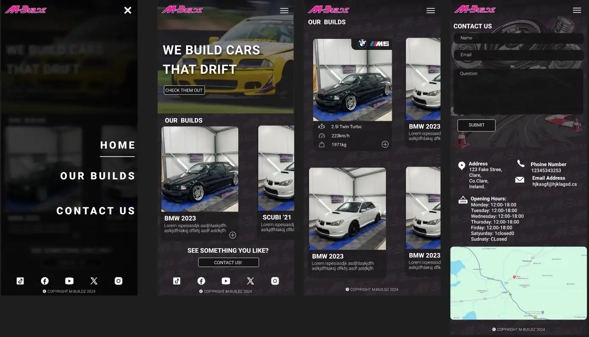
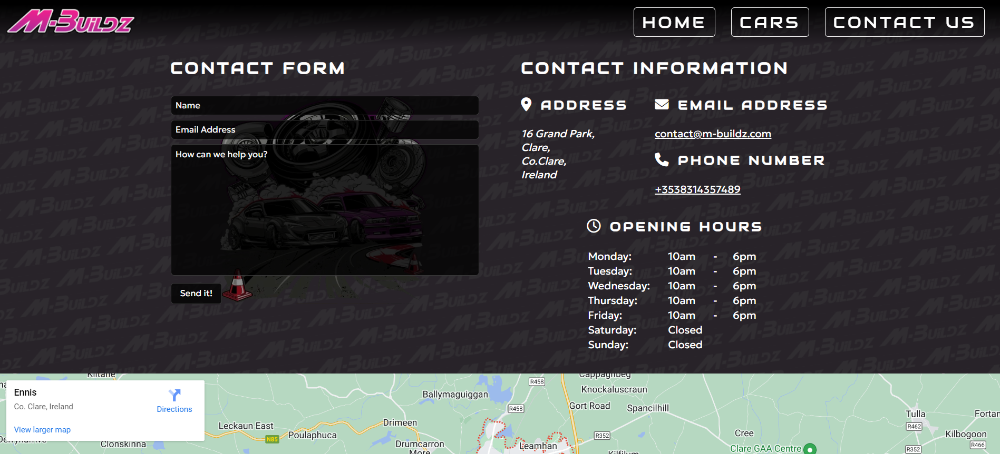

# M-BUILDZ

M-Buildz is a portfolio website for Cavan-based drift car builder M-Buildz. It was designed with a modern, mobile-friendly interface to showcase the beautiful cars that M-Buildz have created over the years and to encourage users who view the portfolio and reach out to M-Buildz via the contact form if they are interested in collaborating with them.

The website is aimed at users who follow M-Buildz on Instagram to take a deeper look into the company's portfolio of car builds. M-Buildz currently conducts all of its business on Instagram and would like to transition into a website store. This website is a first step into achieving that goal by establishing a larger web presence and showcasing some of their previous work.

## [Link to Live site](https://pearsedarcy.github.io/m-buildz/)

## Project Goals

Build an eye-catching, highly performative, entirely responsive website to showcase skills in HTML and CSS. The website should use modern native styling to encourage intuitive use and should display visual confirmation of interactions to the user.

## User Stories

- ### First time user

  - I want to discover the work of M-Buildz.
  - I want to find the content of the website engaging and interactive
  - I want to have the opportunity to discover more about the company by finding its social media accounts.

- ### Returning User

  - I want to contact M-Buildz.
  - I want to find the company's contact information.
  - I want to see any new projects the company is working on

- ### Frequent User
  - I want to follow the progress of the company's car builds.

## Project Scope

With a wide variety of possibilities when starting the project it was important to narrow the scope, and therefore the focus, of what was to be attempted. After much deliberation, a basic format was decided upon.

1. **An Interesting animated loading screen**:
   Loading screens have become commonplace in the world of web development. While it is mostly a practical tool, used to prevent users from bouncing (Clicking off the website before interacting with it), it also can insinuate both quality and mystique. This is the aspect of the element which I want to leverage in this project.

2. **An eye-catching Hero Section**: When the user lands on the page they should instantly know exactly what M-Buildz do.

3. **A Portfolio Section**: The goal of the website is to showcase some of M-Buildz's projects over the years, this will be undertaken using a popular 'Card' section which will contain useful information about some of the cars they have built.

4. **A Contact Section**: The major goal of the website is to encourage users to contact M-Buildz if they are interested in building a car with them. To do this I will implement an inviting contact form, which confirms to the user its submission.

5. **A Intuitive Design**: The design language of the website should be native to the user. Iconography should be of a recognisable standard from which the user can automatically infer its meaning

### Future Goals

M-Buildz eventually would like to add an online store to the website. While that is out of the scope of the current project, it was held as a strong consideration while designing, so that when the time comes to implement a store, the theme and design language would seamlessly integrate into the larger platform.

## Initial Design Considerations

### Figma Sketches

To design to basic layout and structure of the website I built a basic design concept in [Figma](https://figma.com), a popular online design service.

#### Mobile Page Structure

Using a mobile-first approach when beginning with this design was of great importance. M-Buildz interacts with its customers mostly through Instagram, therefore it is safe to assume the majority of the website's visitors will be on mobile.

#### Desktop Page Structure

The design of the desktop page structure is focused on maximising the wide aspect ratio. By stacking the portfolio cards as well as the contact section in a horizontal, or columnar fashion, I was able to make better use of the wider canvas, without making it feel crowded.

## Design Language

M-Buildz has a well-established design language running throughout the history of the company. By dissecting some of their existing branding such as logos and posters, I put together a collection of identifiable themes.

### Color Choice

Considering my enormous bias on the subject, it was very easy to recognise an opportunity to leverage the recent popularity of the 'Dark Theme' design language for this project. The brand's existing imagery has a prevailing use of five major colors; Dark grey, light grey, purple, pink and white. This palette is ideally suited for use in a dark-themed website and complements each other nicely while having adequate contrast for readability and highlighting important features.

### Fonts

Two fonts were chosen with great consideration for the project. Google Fonts API was used to implement the font choice for its seamless integration and cross-browser support. A sans-serif font was chosen in both cases as I feel it to be a more modern typeface.

#### Headings and Buttons

[**Audiowide**](https://fonts.google.com/specimen/Audiowide)

- This font was chosen due to its reasonable similarity to the font used in the M-Buildz logo. It is thematically matched to the broader vision of the brand identity and has many similarities to fonts used in a wider sense across the motor industry. It was ideal for use in larger pieces of text such as Headings and Buttons, however smaller font sizes in not particularly legible so an alternate font was chosen for paragraphs and smaller font sizes.

#### Paragraphs

[**Geologica**](https://fonts.google.com/specimen/Geologica)

- I chose this font due to its readability and scalability. It is a simple sans serif typeface and has many similarities to popular fonts such as Poppins or Roboto.

### Iconography

The automotive industry, much like the web, has a standardised or native set of icons commonly used across brands to represent different elements of the car, such as the infamous engine light. I paired this common iconography with what has become the standard of icon sets in web design i.e. the burger menu, or three horizontal bars to represent a menu. This ensures an intuitive navigation of the website. I used the FontAwesome API for the navigation icons and I used Figma to download the automotive icons.

### Imagery

The majority of the images used on the website were provided by M-Buildz themselves, such as those of the cars and poster. The hero-section element was taken from IStock.com.

## Section Dissection

Here is a breakdown of each of the elements of the website.

### Page Header

The page header was constructed to blend in with the page as much as possible, to not distract from the page content, whilst ensuring branding recognition and intuitive use. On mobile, a 'Burger Menu' icon was used due to its standardisation across mobile applications. When clicked it reveals a side menu with a list of links to different sections of the page. The desktop implementation makes use of the larger canvas by permanently displaying the menu list, enabling quick navigation between sections.

### Page Footer

The page footer displays links to social media accounts and a copyright. The footer scales for use on all screen sizes and the icons have hover interaction for desktop to imply clickability.

### Mobile Navigation Menu

The mobile navigation menu is activated by pressing the burger menu icon in the header.

### Loading Wheel

An element I wanted to incorporate into this website was an animated loading screen. While it is technically unnecessary as the page loads very quickly, I implemented it for aesthetic reasons, and feel that it adds a sense of quality to the website. I took the image from [IStock](https://www.istockphoto.com/de/vektor/pkw-radmontage-eine-gegossene-oder-geschmiedete-scheibe-und-ein-reifen-mit-einer-gm1451096233-487852035?phrase=car+rims) and simplified it using [GIMP](https://www.gimp.org/). I then added it to the webpage and animated it using a series of CSS animations.

### Hero Section

I designed the hero section to indicate clearly what the website is about. I used [this](https://unsplash.com/photos/pink-and-black-stock-car-JrlDdrI2J7Q) image that I found on Unsplash.com. I then desaturated the image in [GIMP](https://www.gimp.org/) and added an animated text heading over it.

### Cars Section

I used the popular 'Card' format to display the portfolio of car builds on the website. On the desktop, they are stacked in columnar fashion to maximise screen space. On mobile, they are stacked as rows to maximise readability.

### Contact Us Section

I added a Contact Form, as well as general contact information to the Contact Us section to allow and encourage users to Contact M-Buildz if they would like to enquire about some of the builds or collaborate on a new build.

## Testing

Throughout the development of this project I continuously tested the website using the [W3C HTML Validator](https://validator.w3.org/nu/?doc=https%3A%2F%2Fpearsedarcy.github.io%2Fm-buildz%2F), The [JigSaw CSS Validator](https://jigsaw.w3.org/css-validator/validator?uri=https%3A%2F%2Fpearsedarcy.github.io%2Fm-buildz%2F&profile=css3svg&usermedium=all&warning=1&vextwarning=&lang=en), and [Google Lighthouse](https://developer.chrome.com/docs/lighthouse). This enabled me to make sure that with every section that was added, the website was tested thoroughly for validity and use on all screens. Below are some screenshots of the final testing of the [deployed website](https://pearsedarcy.github.io/m-buildz/)

### Lighthouse Tests

##### Desktop

#### Mobile

#### W3C HTML Validator

#### Jigsaw CSS Validator

### Links Testing

- I tested all links on the website to ensure they worked correctly.
- I tested all external links to ensure that they would open in a new tab.

### Form Testing

- I tested the form to confirm that it would not submit without validating the requirements, such as the correct email address structure.

### Browser Testing

- I tested the website on a mulitude of browsers to ensure cross browser compatibilty, such as Chrome, FireFox, Safari and Edge.

### Responsiveness Testing

- Using Chrome Dev tools, I tested the website to ensure that it scaled and squashed correctly in a variety of screen sizes and aspect ratios.
- I conducted a final test using [Responsinator](http://www.responsinator.com/?url=https%3A%2F%2Fpearsedarcy.github.io%2Fm-buildz%2F) to validate cross device compatibility.

### Bugs

By using Google Lighthouse throughout the development, many bugs were discovered and squashed.

1. The table used in the opening hours article did not have table headers "<th>", and was leading to a lower accessibility score. I remedied this by adding the table headers and then adding a hidden class to not display them.

2. The accessibility score was also reduced by some elements of aria-labels not matching the text content of the anchor links. This was fixed by ensuring all aria-labels contained the text nested within the anchor links.

3. On mobile, the menu would not close once an anchor link was clicked. To resolve this I added the menu.js file to the project and linked it in the index.html file.

## Deployment

The site was deployed live using [GitHub Pages](https://pages.github.com/).

- This was achieved by enabling Pages in the settings of the GitHub Repository.
- The site was deployed from the Main branch of the repo

## Deployment

The project was deployed using GitHub pages. The steps to deploy using GitHub pages are:

1. Navigate to the [repository](https://github.com/pearsedarcy/m-buildz) on GitHub.com.
2. Click 'Settings' in the page header.
3. Click 'Pages' in the sidebar navigation.
4. Click the dropdown under the source heading and select the 'main' branch.
5. Click 'Save'.
6. You will recieve a green confirmation banner confirming the site deployment and live link.

The Live Link to the website is available [here](https://pearsedarcy.github.io/m-buildz/)

## Credits

### Media

- The majority of the media, such as the logo, poster and car images were collected from [M-Buildz Instagram account](https://www.instagram.com/m_buildz/).

- The Hero Image was found on Unsplash.com [here](https://unsplash.com/photos/pink-and-black-stock-car-JrlDdrI2J7Q)

- The loading wheel image was found on IStock.com [here](https://www.istockphoto.com/de/vektor/pkw-radmontage-eine-gegossene-oder-geschmiedete-scheibe-und-ein-reifen-mit-einer-gm1451096233-487852035?phrase=car+rims)

### Content

- I used the [Love Running Walkthrough Project](https://github.com/Code-Institute-Solutions/love-running-v3) from Code Institute as a guideline for building the Header and Footer.

- I referenced StackOverFlow, CodePen and MDN WebDocs throughout building the project to help with better understanding and implementing elements, sections and animations
  - [This](https://developer.mozilla.org/en-US/docs/Web/CSS/Layout_cookbook/Card) MDN Doc was great for the Cards section
  - [This](https://stackoverflow.com/questions/17296919/how-to-prevent-css3-animation-reset-when-finished) StackOverflow forum helped me with preventing the animations from looping.
  - [This](https://codepen.io/AdamCCFC/pen/WvzBKq) CodePen example helped me with the hover grow effect on the social media icons.

### Technologies Used

- **Languages**

  - HTML
  - CSS
  - Javascript

- **Development**

  - The website was built in [VS Code](https://code.visualstudio.com/).

- **Version Control**

  - The project was version controlled using [Git](https://git-scm.com/) and [GitHub](https://github.com).

- **Images**

  - The images for the website were edited and compressed using [GIMP](https://gimp.org)

- **Design**

  - The initial design was concieved in [Figma](https://figma.com).

- **Icons**

  - The icons were imported from [Font Awesome](https://fontawesome.com/icons)

- **Fonts**

  - The fonts were imported from [Google Fonts](https://fonts.google.com/)

- **Map**

  - The map was embedded from [Google Maps](maps.google.com)

#### Special Thanks

I would like to give a special thanks to my mentor Antonio Rodriquez who helped me throughout the development of this project.
